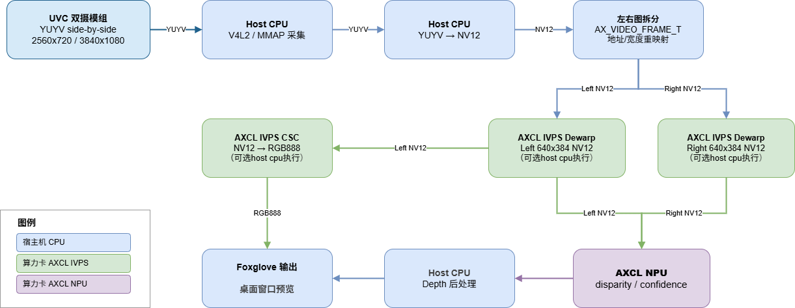

# Stereo Depth 示例（AXCL版本）

## 架构设计


## 已验证平台

| 硬件平台 | 操作系统 |
| --- | --- |
| Raspberry Pi 5 | Debian GNU/Linux 13 (trixie) |
| AMD64 PC | Ubuntu 22.04.4 LTS |

## 支持的模组

- ZED Mini Stereo Camera

## 编译

### 安装依赖

```bash
sudo apt update
sudo apt install -y build-essential cmake pkg-config \
    libopencv-dev libavcodec-dev libavutil-dev libswscale-dev libcurl4-openssl-dev
```

请确认已安装 AXCL 驱动 ，并用 `axcl-smi` 确认算力卡工作正常。

### 构建

在工程根目录执行：

```bash
make clean
make build
make install
```

- 编译输出：`build/`
- 安装输出：`output/sample_stereo_depth/`

## 运行

安装后目录结构：

```text
output/sample_stereo_depth/
├── sample_stereo_depth
├── lib/
└── models/
```

### 默认运行（UVC 采集 + 预览窗口 + foxglove 发布）

```bash
cd output/sample_stereo_depth
./sample_stereo_depth
```

### 回放 MCAP 文件

```bash
./sample_stereo_depth -i /path/to/your_dump.mcap
./sample_stereo_depth -i /path/to/your_dump.mcap --mcap-stream h264 # 回放录制里的 H.264 流
```

### 不开预览窗口（无桌面预览，仅 foxglove 发布）

```bash
./sample_stereo_depth --no-vo -i /path/to/your_dump.mcap
```

### --imgproc参数说明
- `--imgproc <host|axcl|auto>`：图像处理后端，**默认 `auto`**。
- `auto` / `axcl`：优先用算力卡 IVPS 做图像处理，失败时自动回退HOST CPU。
- `host`：全部用HOST CPU 执行图像处理。

## 常见说明
- 默认 NPU 模型从安装目录 `models/axstereo_pro.axmodel` 加载。
- 运行前会检查 AXCL host 驱动（`/dev/axcl_host`）与 `axcl-smi`，不满足则拒绝运行。
- 点云仅在 `/camera/pointcloud` 有订阅或正在录制时才计算，以节省 CPU。

## 详细说明

- 更完整的运行参数，请参阅 https://zhuanlan.zhihu.com/p/2047786127969477270。
